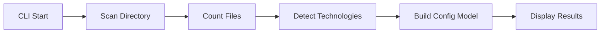
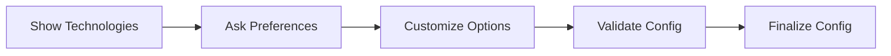
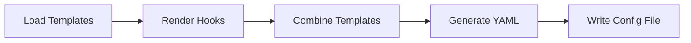

# Technical Architecture

This document outlines the technical architecture of Pre-commit Starter, explaining the system design, component interactions, and implementation details.

## System Overview

Pre-commit Starter is a Python-based CLI tool that automates the generation of pre-commit hook configurations. The system follows a modular architecture with clear separation of concerns:

```
┌─────────────────┐     ┌─────────────────┐     ┌─────────────────┐
│   Discovery     │────▶│ Template        │────▶│ Configuration   │
│   Engine        │     │ Renderer        │     │ Generator       │
└─────────────────┘     └─────────────────┘     └─────────────────┘
        ▲                       ▲                        ▲
        │                       │                        │
        └───────────────────────┴────────────────────────┘
                               ▲
                        ┌──────┴───────┐
                        │     CLI      │
                        └──────────────┘
```

## Project Structure

```
pre_Commit_Starter/
├── __init__.py
├── __main__.py              # Entry point for python -m pre_Commit_Starter
├── main.py                  # Interactive CLI interface
├── config.py                # Configuration data models
├── discover.py              # Technology detection engine
├── render_template.py       # Template rendering and config generation
└── hook_templates/          # Jinja2 templates for hooks
    ├── __init__.py
    ├── base.j2             # Base hooks (file types, security)
    ├── python.j2           # Python hooks (ruff, mypy)
    ├── js.j2               # JavaScript/TypeScript hooks
    ├── go.j2               # Go hooks
    ├── docker.j2           # Docker hooks
    ├── github_actions.j2   # GitHub Actions hooks
    └── meta.j2             # Meta hooks (hook ordering)
```

## Core Components

### 1. Discovery Engine (`discover.py`)

#### Purpose
- Analyzes repository content
- Detects technologies and frameworks
- Builds configuration models

#### Key Functions
```python
def discover_files(directory: Path) -> dict[str, int]:
    """Scan directory and count files by type."""

def discover_config(directory: Path) -> PreCommitConfig:
    """Main discovery function that returns complete configuration."""
```

#### Detection Logic
- **File Extension Analysis**: Maps extensions to technologies
- **Configuration File Detection**: Finds `package.json`, `go.mod`, etc.
- **Content Analysis**: Looks for import statements, function patterns
- **Smart Detection**: Combines multiple signals for accuracy

#### Supported Technologies
- **Python**: Detects `.py` files, `pyproject.toml`, `uv.lock`
- **JavaScript/TypeScript**: Detects `.js`/`.ts` files, `package.json`
- **Go**: Detects `.go` files, `go.mod`
- **Docker**: Detects `Dockerfile`, `docker-compose.yml`
- **GitHub Actions**: Detects `.github/workflows/`
- **File Types**: YAML, JSON, TOML, XML

### 2. Configuration Models (`config.py`)

#### Purpose
- Defines data structures for configuration
- Validates configuration options
- Provides type safety

#### Key Classes
```python
@dataclass
class PreCommitConfig:
    """Main configuration class with all options."""
    python: bool = False
    js: bool = False
    go: bool = False
    docker: bool = False
    github_actions: bool = False
    # ... other fields
```

#### Features
- **Pydantic Integration**: Data validation and serialization
- **Default Values**: Smart defaults based on detection
- **Type Hints**: Full type coverage for IDE support

### 3. Template Renderer (`render_template.py`)

#### Purpose
- Renders Jinja2 templates to generate hook configurations
- Combines multiple hook templates into final config
- Handles template logic and conditionals

#### Key Classes
```python
class TemplateRenderer:
    """Unified template rendering for hooks and configs."""

    def generate_hooks(self, config: PreCommitConfig) -> str:
        """Generate hook configuration from templates."""

    def render_config(self, config: PreCommitConfig) -> str:
        """Render complete pre-commit configuration."""
```

#### Template System
- **Jinja2 Templates**: Flexible template rendering
- **Conditional Logic**: Templates adapt based on detected technologies
- **Hook Composition**: Multiple templates combine into final config

### 4. CLI Interface (`main.py`)

#### Purpose
- Provides interactive user experience
- Displays detection results
- Collects user preferences

#### Features
- **Rich UI**: Beautiful tables and panels using Rich library
- **Interactive Prompts**: User-friendly configuration questions
- **Smart Defaults**: Pre-filled with detected values
- **Progress Feedback**: Visual indication of processing

## Data Flow

### 1. Repository Analysis


### 2. User Interaction


### 3. Configuration Generation


## Hook Templates

### Template Structure
Each technology has its own template file in `hook_templates/`:

```jinja2
# Example: python.j2

  - repo: https://github.com/astral-sh/ruff-pre-commit
    rev: v0.8.4
    hooks:
      - id: ruff
        args: [--fix]
      - id: ruff-format

  - repo: https://github.com/pre-commit/mirrors-mypy
    rev: v1.15.0
    hooks:
      - id: mypy
        additional_dependencies: [tomli>=2.0.0]


```

### Template Features
- **Conditional Rendering**: Only includes hooks for detected technologies
- **Flexible Configuration**: Adapts based on project specifics
- **Version Management**: Keeps hook versions up to date

## Development Tools

### Makefile Targets
```bash
make install    # Install dependencies
make run        # Run the tool
make test       # Run tests
make build      # Build package
make clean      # Clean artifacts
```

### Testing Strategy
- **Unit Tests**: Test individual components
- **Integration Tests**: Test complete workflows
- **Fixture-based Testing**: Use sample projects for testing
- **Property-based Testing**: Hypothesis for edge cases

### Code Quality
- **Ruff**: Linting and formatting (replaces flake8)
- **MyPy**: Type checking
- **Pre-commit**: Self-dogfooding with generated configs

## Design Principles

### 1. Simplicity
- Minimal user interaction required
- Smart defaults based on detection
- Clear, focused functionality

### 2. Extensibility
- Template-based hook system
- Easy to add new technologies
- Modular architecture

### 3. Reliability
- Comprehensive testing
- Type safety throughout
- Graceful error handling

### 4. User Experience
- Rich, interactive interface
- Clear feedback and progress
- Helpful error messages

## Performance Considerations

### File Scanning
- Efficient directory traversal
- Skips irrelevant directories (`.git`, `node_modules`)
- Caches detection results

### Template Rendering
- Lazy template loading
- Efficient Jinja2 rendering
- Minimal memory usage

## Security Considerations

### Template Safety
- Jinja2 sandboxing
- No arbitrary code execution
- Validated template inputs

### Configuration Safety
- YAML syntax validation
- Hook source verification
- Secure defaults

## Future Enhancements

### Technical Improvements
- Async file scanning for large repositories
- Plugin system for custom hooks
- Configuration profiles and presets

### User Experience
- Web-based configuration interface
- Hook performance analytics
- Integration with popular IDEs

### Additional Technologies
- Support for more languages (Ruby, PHP, etc.)
- Framework-specific hooks (Django, React, etc.)
- Cloud-specific configurations (AWS, GCP, etc.)
